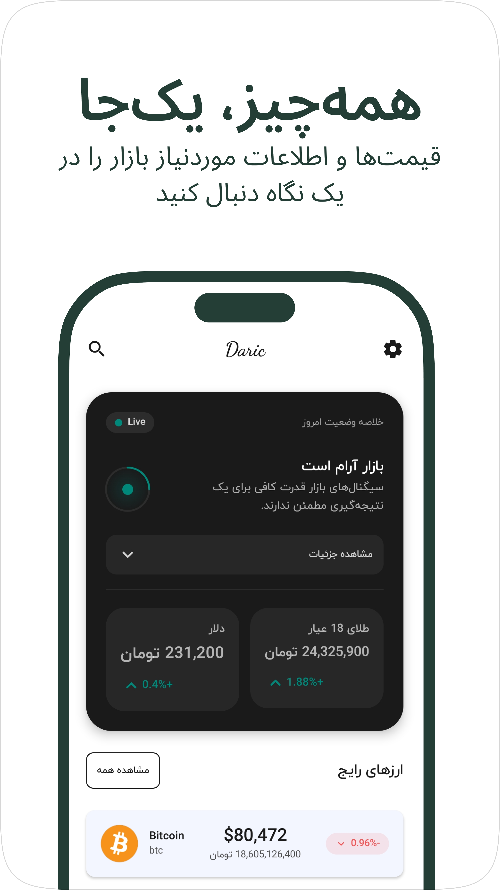
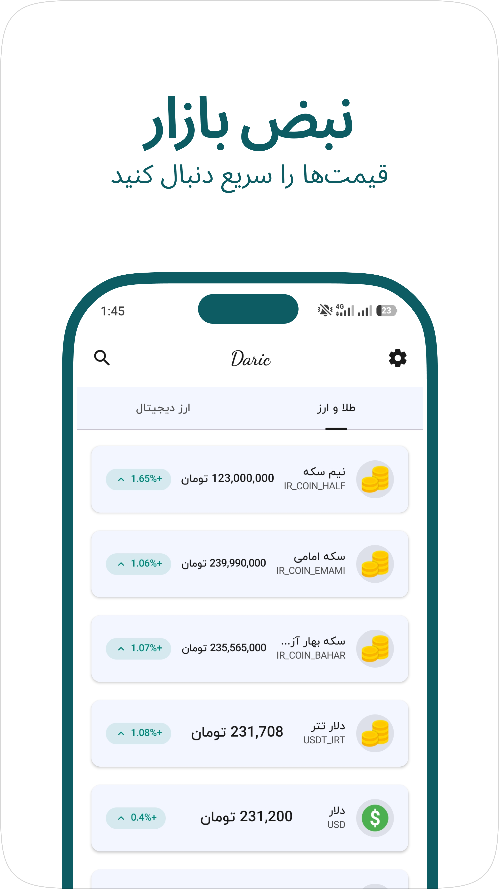
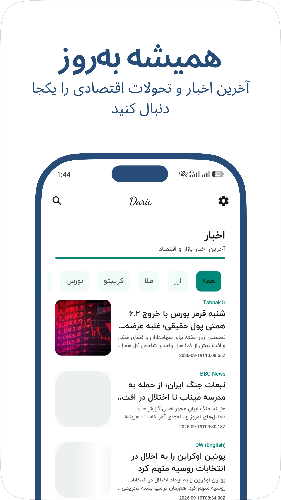

# Daric

<p align="center">
  
</p>

<h3 align="center">A modern Android application for tracking financial markets</h3>

<p align="center">
  Built with Kotlin, Jetpack Compose, Clean Architecture, and a security-focused approach.
</p>

<p align="center">

[](https://kotlinlang.org/)
[](https://developer.android.com/compose)
[](https://dagger.dev/hilt/)
[](LICENSE)

</p>

---

## 📱 Overview

**Daric** is a modern Android application designed to provide a simple and focused experience for monitoring financial markets.

The application brings market prices, economic information, and financial news together in a clean and responsive interface.

Daric was built with a strong focus on:

* Modern Android development
* Clean and maintainable architecture
* Reactive UI and state management
* Modular project structure
* Security-aware development
* Testability and maintainability
* Production-oriented release practices

The project is also part of my journey toward specializing in **Android Application Security and Mobile Penetration Testing**.

---

## ✨ Features

### 📊 Market Monitoring

* View market prices in a clean and readable interface
* Track gold and currency information
* Quickly access important market data
* Responsive layouts for different screen sizes

### 📰 Financial News

* Browse economic and financial news
* Stay informed about important market events
* Clean reading experience optimized for mobile

### ⚙️ Settings

* System / Light / Dark theme
* Notification preferences
* Myket rating integration
* RTL-friendly Persian interface

### 🔐 Security

Security is treated as a first-class concern in Daric.

The current security layer includes:

* Root detection
* Rooted-device execution blocking
* R8 code shrinking and obfuscation
* Resource shrinking
* StrictMode during development
* Dedicated security abstractions
* Security checks isolated from application features
* Secure handling of build-time configuration

Security development is guided by concepts from the **OWASP Mobile Application Security Verification Standard (MASVS)** and the **OWASP Mobile Application Security Testing Guide (MASTG)**. MASVS provides a security baseline covering areas such as storage, network communication, platform interaction, code quality, resilience, and privacy.

> Security controls are continuously evolving as the project moves toward deeper Android security testing.

---

# 🖼️ Screenshots

<p align="center">
  
  &nbsp;&nbsp;
  
  &nbsp;&nbsp;
  
</p>

<p align="center">
  <b>Home</b>
  &nbsp;&nbsp;&nbsp;&nbsp;
  <b>Market</b>
  &nbsp;&nbsp;&nbsp;&nbsp;
  <b>News</b>
</p>

---

# 🏗️ Architecture

Daric follows a **modular Clean Architecture** approach designed to keep responsibilities separated and make the application easier to maintain, test, and evolve.

The project separates UI, business logic, data access, and shared infrastructure into dedicated modules.

### Architecture principles

* Separation of concerns
* Dependency inversion
* Unidirectional data flow
* Reactive state management
* Dependency injection
* Feature-based organization
* Testability

### High-level architecture

```text
┌──────────────────────────────────────────┐
│                   UI                     │
│       Jetpack Compose / Material 3       │
└────────────────────┬─────────────────────┘
                     │
                     ▼
┌──────────────────────────────────────────┐
│               Features                   │
│  Home • Market • News • Settings • ...  │
└────────────────────┬─────────────────────┘
                     │
                     ▼
┌──────────────────────────────────────────┐
│              Domain Layer                │
│        Use Cases • Business Rules        │
└────────────────────┬─────────────────────┘
                     │
                     ▼
┌──────────────────────────────────────────┐
│                Data                      │
│     Repositories • API • Local Data      │
└────────────────────┬─────────────────────┘
                     │
                     ▼
┌──────────────────────────────────────────┐
│             Infrastructure               │
│ Retrofit • Serialization • OkHttp • ... │
└──────────────────────────────────────────┘
```

---

# 🧩 Project Structure

The project is organized into multiple Gradle modules to keep responsibilities isolated.

```text
Daric/
│
├── app/
│   └── Main application module
│
├── core/
│   ├── common/
│   ├── data/
│   ├── database/
│   ├── designsystem/
│   ├── model/
│   ├── network/
│   └── ...
│
├── feature/
│   ├── home/
│   ├── market/
│   ├── news/
│   ├── setting/
│   └── ...
│
├── build-logic/
│   └── Convention plugins
│
├── docs/
│   └── images/
│
├── gradle/
│
├── build.gradle.kts
├── settings.gradle.kts
└── README.md
```

The exact module structure may evolve as the project grows.

---

# 🛠️ Tech Stack

| Technology               | Usage                          |
| ------------------------ | ------------------------------ |
| **Kotlin**               | Primary programming language   |
| **Jetpack Compose**      | Declarative UI                 |
| **Material 3**           | UI components and theming      |
| **Hilt**                 | Dependency injection           |
| **Coroutines**           | Asynchronous programming       |
| **Flow**                 | Reactive data streams          |
| **Retrofit**             | HTTP networking                |
| **OkHttp**               | Network client                 |
| **Kotlin Serialization** | JSON serialization             |
| **Coil**                 | Image loading                  |
| **R8**                   | Code shrinking and obfuscation |
| **Gradle Kotlin DSL**    | Build configuration            |
| **JUnit**                | Unit testing                   |
| **Compose UI Testing**   | UI testing                     |
| **Jacoco**               | Code coverage                  |
| **Roborazzi**            | Screenshot testing             |
| **Baseline Profiles**    | Startup/runtime performance    |

---

# 🌐 Networking

Daric communicates with remote APIs through a dedicated networking layer.

The network stack is built around:

```text
Retrofit
   │
   ▼
OkHttp
   │
   ▼
Kotlin Serialization
   │
   ▼
Repository
   │
   ▼
Use Case
   │
   ▼
UI
```

API configuration is injected at build time rather than hardcoded directly into the source code.

---

# 🔐 Security Architecture

Security-related functionality is isolated inside a dedicated security package.

```text
security/
└── root/
    ├── RootDetector.kt
    ├── AndroidRootDetector.kt
    ├── RootDetectorModule.kt
    ├── SecurityManager.kt
    ├── SecurityStatus.kt
    └── RootDetectedScreen.kt
```

The security flow is intentionally separated from the application's feature logic.

```text
                    MainActivity
                         │
                         ▼
                 SecurityManager
                         │
                         ▼
                   RootDetector
                         │
                ┌────────┴────────┐
                │                 │
              Secure         RootDetected
                │                 │
                ▼                 ▼
             DaricApp       Security Screen
```

### Current root detection

Daric currently checks several indicators, including:

* Common `su` binary locations
* Magisk-related paths
* Android `test-keys`

If a rooted environment is detected, the application blocks normal execution and displays a dedicated security screen.

> Root detection is a defense-in-depth control, not a guarantee that a device is uncompromised.

---

# 🧪 Testing

Testing is part of the project's development workflow, with the current focus primarily on validating application logic and maintaining code quality.

### Unit Tests

Unit tests are used where applicable for:

* Business logic
* Use cases
* ViewModels
* State transformations
* Repository behavior

### Test Infrastructure

The project includes testing infrastructure for future expansion, including:

* JUnit
* JaCoCo
* Roborazzi

### UI Testing

UI test coverage is **not currently implemented**.

The project may expand its UI testing coverage in future development as additional features and security-sensitive flows are introduced.

### Screenshot Testing

Roborazzi is included in the project for screenshot-based UI verification and visual regression testing where applicable.

---

# 🚀 Build & Run

### Requirements

* Android Studio
* JDK compatible with the project's Gradle/Android configuration
* Android SDK
* An Android device or emulator

Clone the repository:

```bash
git clone https://github.com/AliAyali/daric.git
cd daric
```

Open the project in Android Studio and allow Gradle to synchronize.

Then run the application using the `debug` configuration.

---

# 🔑 Configuration

Some development configuration values are provided through `local.properties`.

For example:

```properties
newsApiKey=YOUR_API_KEY
```

> Do not commit secrets or private credentials to the repository.

If you are setting up the project locally, create the required configuration values in your local environment before building.

---

# 📦 Release

Daric uses **Git Flow** for release management.

The release process follows a workflow similar to:

```text
feature/*
    │
    ▼
 develop
    │
    ▼
release/1.0.0
    │
    ├── Testing
    ├── Bug fixing
    ├── Release validation
    │
    ▼
 master
    │
    ▼
 Signed Release AAB
    │
    ▼
 Myket
```

The project uses R8 and resource shrinking for release builds.

Release configuration includes:

```kotlin
isMinifyEnabled = true
isShrinkResources = true
```

A signed release bundle is generated through Android Studio before publishing.

---

# 📲 Myket

Daric is prepared for distribution through **Myket**.

The application includes a dedicated rating action in Settings that opens the Myket review flow when the Myket URI handler is available.

```text
myket://comment?id=<PACKAGE_NAME>
```

The application also safely checks whether an activity can handle the URI before attempting to launch it.

---

# 🎯 Project Goals

Daric started as an Android development project and gradually evolved into a practical environment for exploring production-oriented Android development and security.

The main goals are:

* Build a real-world Android application
* Practice modern Android architecture
* Improve testing discipline
* Apply secure development practices
* Explore Android application security
* Analyze the application's attack surface
* Practice reverse engineering and security testing
* Prepare the application for real distribution

---

# 🗺️ Roadmap

The security roadmap is intentionally incremental.

### Android Development

* [x] Modern Kotlin architecture
* [x] Jetpack Compose
* [x] Modularization
* [x] Dependency injection
* [x] Networking layer
* [x] Testing infrastructure
* [x] Release workflow
* [x] Myket integration

### Security

* [x] Security abstraction layer
* [x] Root detection
* [x] Rooted-device blocking
* [x] R8 / code shrinking
* [x] Resource shrinking
* [x] Debug StrictMode
* [ ] Deeper static analysis
* [ ] Reverse engineering assessment
* [ ] Runtime security testing
* [ ] Network security assessment
* [ ] Tampering / repackaging assessment
* [ ] Broader OWASP MASVS/MASTG verification

---

# 🧭 Security Testing Direction

Future security work will focus on practical Android application security testing, including:

```text
Static Analysis
      │
      ├── APK analysis
      ├── JADX
      ├── Manifest review
      └── Decompiled code review
              │
              ▼
Dynamic Analysis
      │
      ├── Runtime behavior
      ├── Log analysis
      ├── IPC
      └── Application state
              │
              ▼
Network Security
      │
      ├── Traffic inspection
      ├── TLS configuration
      └── API behavior
              │
              ▼
Resilience
      │
      ├── Repackaging
      ├── Tampering
      ├── Root environments
      └── Reverse engineering
```

The security work is informed by the OWASP MASVS and MASTG, which provide structured requirements and testing guidance for mobile applications.

---

# 📚 Security References

* [OWASP Mobile Application Security](https://mas.owasp.org/)
* [OWASP MASVS](https://mas.owasp.org/MASVS/)
* [OWASP MASTG](https://mas.owasp.org/MASTG/)
* [OWASP MASWE](https://mas.owasp.org/MASWE/)

---

# 👨‍💻 Author

**Ali Ayali**

Android Developer focused on Kotlin, Jetpack Compose, Clean Architecture, and Android Application Security.

* GitHub: [@AliAyali](https://github.com/AliAyali)
* Website: [aliayali.ir](https://aliayali.ir)
* LinkedIn: [Ali Ayali](https://www.linkedin.com/in/ali-ayali2004/)
* Telegram: [@ali_ayali](https://t.me/ali_ayali)

---

# 📄 License

This project is licensed under the MIT License.

See the [LICENSE](LICENSE) file for details.

---

<p align="center">
  Built with Kotlin & ❤️
</p>

<p align="center">
  <sub>Daric — Android Application & Security Project</sub>
</p>
